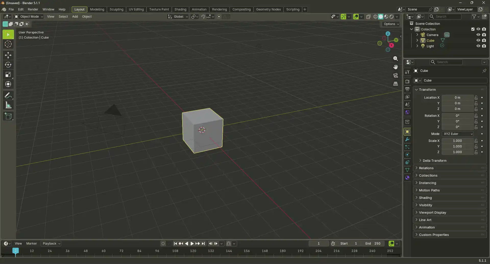
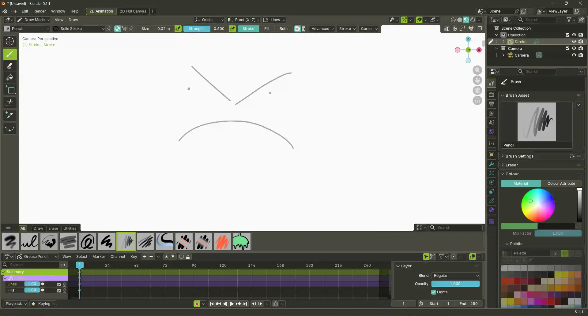
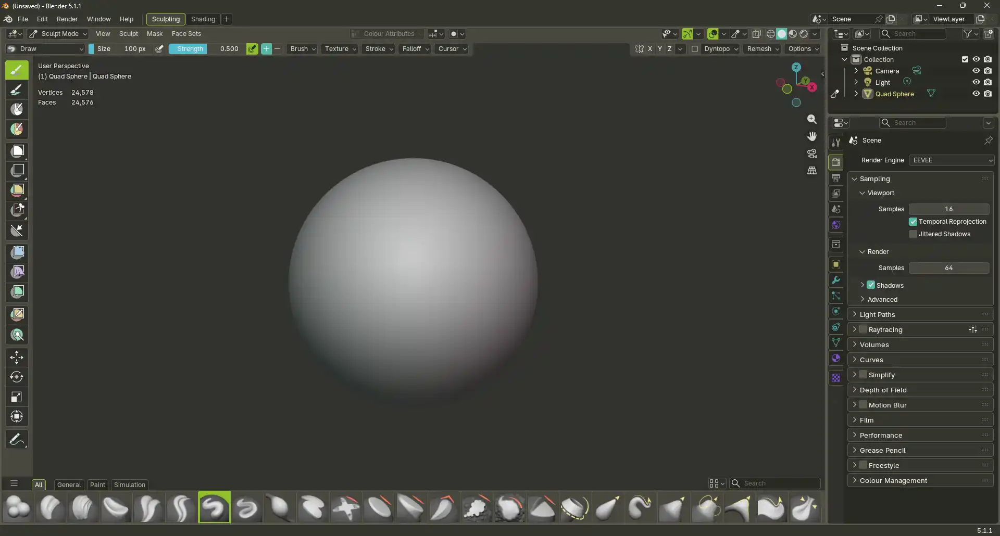
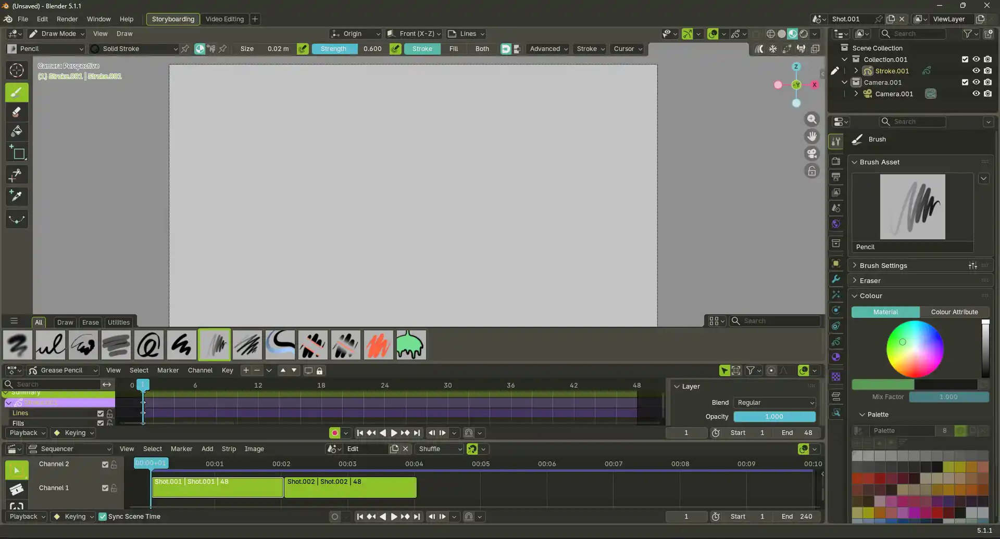
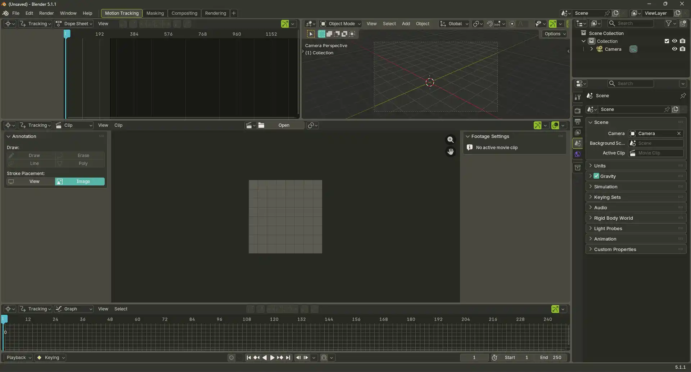
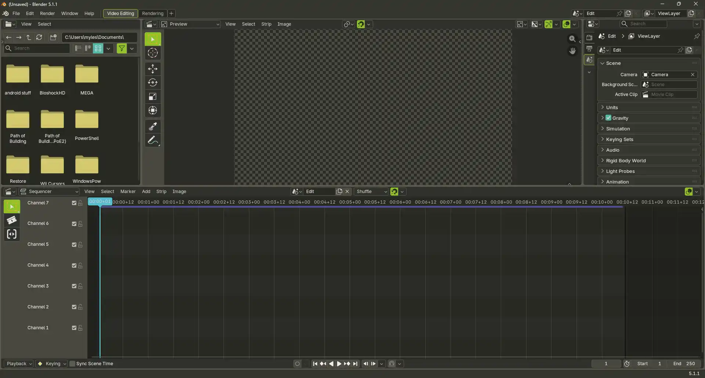

# blender-monokai

A theme for Blender I made that is inspired by my favorite colorscheme, the classic Monokai!

> [!IMPORTANT]
> This is a theme I created for myself with very little knowledge and experience in creating blender themes. I think I have done quite well but there is always room for improvement, so if you find a page that isn't properly themed or something wrong with UX/Readability I would be glad to fix the issue if you let me know :)

  
  

  
  

  
  

---

## Usage

First you're gonna have to download the theme itself first.  
Here is a sweet little link to the latest version of the theme since im SO KIND.

<https://github.com/CannedToes/blender-monokai/raw/refs/heads/main/Monokai.xml>
> [!NOTE]
> Right click the link and click `Save Link As`

---

## Acknowledgements

- [SylEleuth/blender-gruvbox](https://github.com/SylEleuth/blender-gruvbox)  
  a theme that I used for inspiration and sort of the layout to making an actually readable theme that actually looks somewhat decent. I am not a graphic designer.

- [5argon/monokai-blender](https://github.com/5argon/monokai-blender)  
  another monokai theme that I used for a while and really like but it was made for a way older blender version and isn't as "classic piss yellow" as I wanted it to be. If you don't like mine definitely check out this one it's great!

- [Wimer Hazenberg](https://wimer.frl/)  
  the goat and creator of the original monokai color scheme, he is actually an amazing artist too and creates stuff under a creative studio called... [monokai](https://monokai.com), please go check him out he is awesome.

- [Blender](https://www.blender.org/)  
  last but in no way least, the absolutely incredible team behind Blender who continue to prove that free, open source software is the best thing that has ever been gifted to planet earth. PLEASE donate to them if you have money they are truly a miracle.
